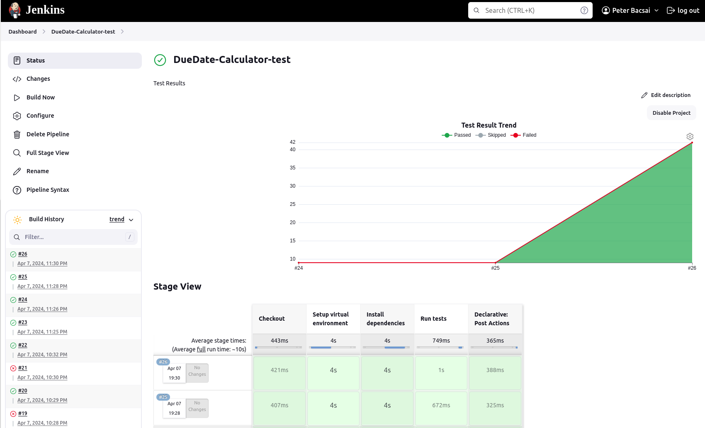
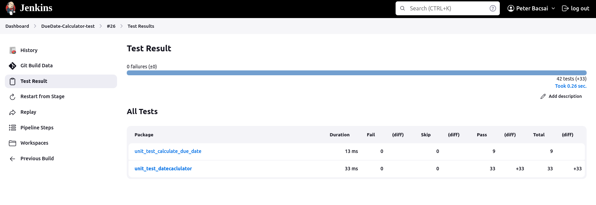

# Due Date Calculator

Long-long time ago in a galaxy far away...  I was involved in a project focused on calculating SLA times. Initially, this task appeared straightforward, but it quickly became complex due to the inclusion of holidays from various nations, different time zones, diverse work schedules, and the most interesting problem, the leap day. 

To address this challenge, I developed a Python module aimed at simplifying the process of calculating due dates, or time delta relative to a date. The primary objective was to ensure its simplicity while meticulously crafting unit tests for the code. Leveraging Jenkins, I executed these tests to identify and rectify any potential issues within the codebase.

The class is also able to calculate Timedelta from a start date to an end date.

Now, I'm sharing this code to assist others encountering similar challenges.
The first version was to just calculate the due date 
Class: 
- calculate_due_date.py
Unit tests:
- unit_test_calculate_due_date.py


The fine grained version 
Class:
- datecalculator.py # contains all the functions to calculate due dates. 
Unit tests:
- unit_test_datecaclulator # Contains the unit tests of the class

# To run the code in your Linux
I recommend to use a virtual environment to run the tests (or any of your python scripts)

To create a virtual environment run the following commands and replace the {vitrual environment name} with a name of your choice:

```
$ python3 -m venv {vitrual environment name} 
$ source {vitrual environment name}/bin/activate
```

### Then clone the code

```
$ git clone https://github.com/MaXIP21/date-calculator.git
```

### Lastly install the requirements

```
$ pip3 install -r date-calculator/requirements.txt
```


### To run the unittests
```
python -m unittest unit_test_calculate_due_date.py
python -m unittest unit_test_datecaclulator.py
```

### Example output 
```
(unittest-venv) ~/date-calculator$ python -m unittest unit_test_calculate_due_date.py
.........
----------------------------------------------------------------------
Ran 9 tests in 0.007s

OK
(unittest-venv) ~/date-calculator$ python -m unittest unit_test_datecaclulator.py
.................................
----------------------------------------------------------------------
Ran 33 tests in 0.003s

OK
```
## Jenkins results


## Junit test results
